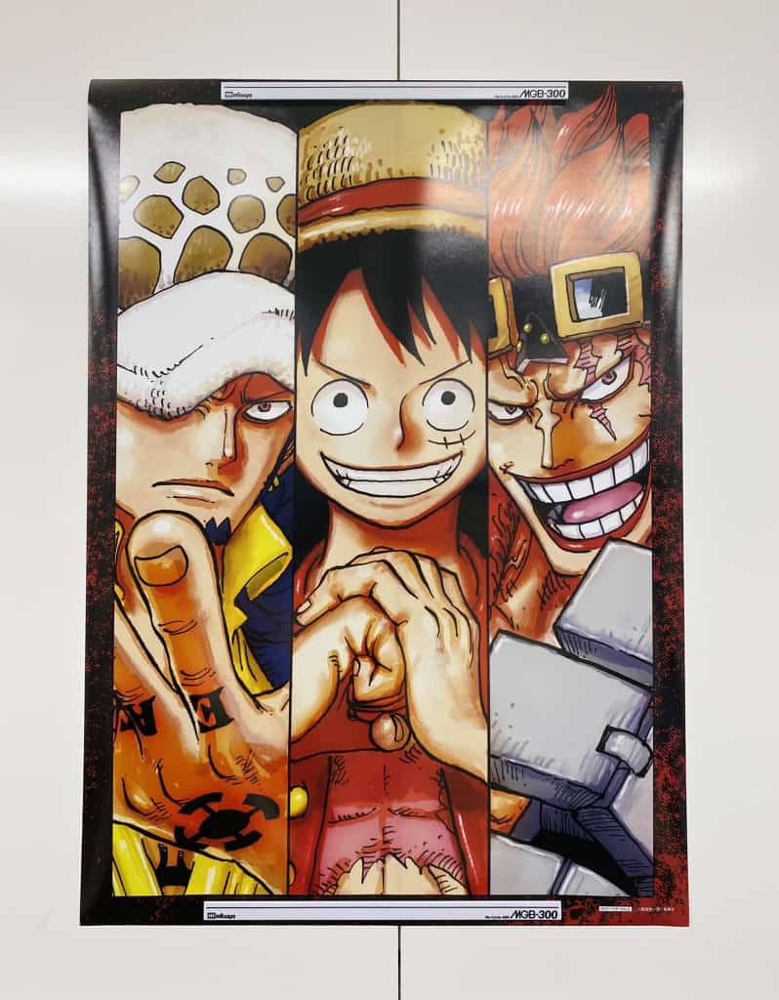

   

  Hola 👋🏽, Soy [Junior felix!](https://github.com/juniorfelixgb)  
   .NET Developer, Blazor Webassembly.  
Actualmente resido en Republica Dominicana 🇩🇴  
  **Sobre mi**  
  Administrador de Blazor Dominicana 🇩🇴  
   :star2: :star2: :star2: :star2: :star2:

    
👨🏽‍💻 Creo proyectos todos los dias con el fin de mejorar mis habilidades;

    
🌱 Actualmente estoy aprendiendo Blazor WebAssembly y Vue.js;

    
💬 Me mantengo en constante aprendizaje;

    
🛰 2021 Goals: Dominar Blazor WebAssemby y Blazor Mobile Bindings y mejorar mis habilidades dotnet;

    
💬 Preguntame cualquier cosa, estoy dispuesto a ayudarte!;

    
📫 Contactame: juniorfelixgb@gmail.com;

## 🛰 Ver [Proyectos!](... In Progress)
 

#### Languages and Frameworks:

<code></code>
<code></code>
<code></code>
<code></code>
<code></code>
<code></code>
<code></code>
<code></code>
<code></code>
<code></code>
<code></code>
<code></code>
<code></code>
<code></code>
<code></code>
 
 

#### Tools:

#### Deployment

#### OS

 
 

### 📫 Let's Connect:

 
 

#### Languages and Tools

 |  Languages | Tools | Framewors |
 | ----------- | ----------- |----------- |
 C#    | Visual Studio | Bootstrap
 ASP.NET MVC | VS Code | React.JS
 .NET CORE | SQL Server Management Studio | MVC
 ASP.NET NET CORE | Toad For Oracle | Vue.js
 CSS3 | Android Studio | Angular
 JS | Sourcetree | Xamarin.Forms
___

 
 

#### My Streaks And Contributions :fire:

  
___

 
 

#### Most used languages :computer:

___

#### :v: Visitantes

___

##### Thanks!
